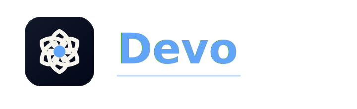
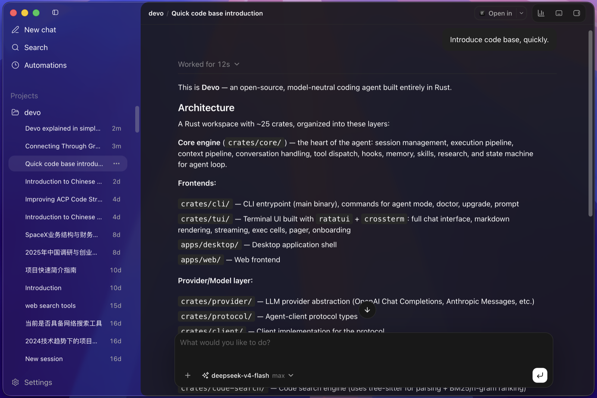
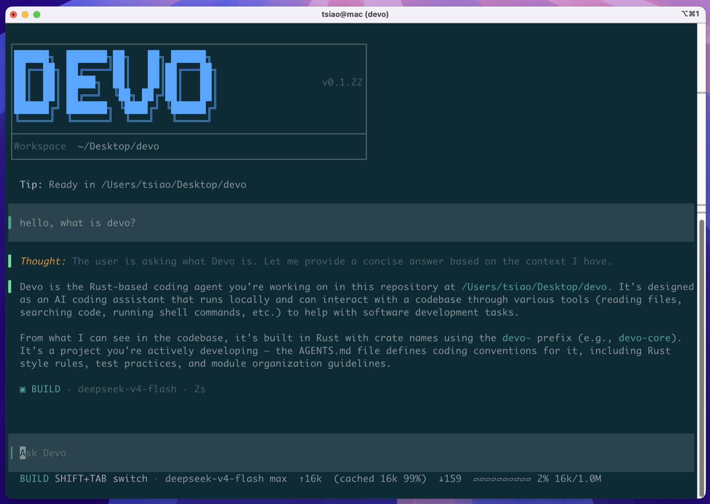

<div align="center">



</div>

<div align="center">

**Devo - open-source coding agent с Desktop app, terminal TUI/CLI и модельно-нейтральным Rust runtime для приватных, корпоративных и OpenAI-совместимых модельных сред. Подключайте DeepSeek, Qwen, Kimi, Anthropic-совместимые API, локальные шлюзы или собственные endpoint моделей.**

[](https://github.com/7df-lab/devo/stargazers)
[](https://www.rust-lang.org/)
[](./LICENSE)
[](https://github.com/7df-lab/devo/pulls)
[](https://github.com/7df-lab/devo/actions)
[](https://github.com/7df-lab/devo/releases)

[English](./README.md) | [简体中文](./README.zh-Hans.md) | [繁體中文](./README.zh-Hant.md) | [日本語](./README.ja.md) | [Русский](./README.ru.md)

[Почему Devo](#почему-devo) · [Скриншоты](#скриншоты) · [Возможности](#возможности) · [Проверенные модели](#проверенные-модели) · [Проверенные платформы](#проверенные-платформы) · [Установка](#установка) · [Быстрый старт](#быстрый-старт) · [Документация](#docs)

</div>

---

## Скриншоты

<p align="center">
  
</p>

<p align="center">
  
</p>

## Почему Devo

Devo предназначен для команд, которым нужен coding agent вне единой hosted
экосистемы моделей. Он оставляет Desktop experience, terminal workflow, выбор
модели, поведение runtime и выполнение в workspace под вашим контролем.

- **Подключайте свою модель** - Через provider/model bindings можно подключать
  OpenAI-compatible Chat Completions, OpenAI-compatible Responses, Anthropic
  Messages, DeepSeek, Qwen, Kimi или приватные model gateways.
- **Подходит для приватных и intranet-сред** - Devo запускается как единый
  локальный Rust binary, поддерживает offline installation paths и может
  указывать на внутренние endpoint без зависимости от hosted agent service.
- **Один agent для Desktop и terminal** - Используйте Desktop app для
  визуального onboarding и повседневного coding, либо CLI/TUI для
  terminal-native automation, remote shell и scriptable workflows.
- **Расширяемый agent runtime** - MCP servers, reusable skills, локальный
  semantic code search, аудируемые сессии, permissions и multi-agent flows
  являются возможностями runtime, а не одноразовыми prompt.

## Возможности

- **Встроенный семантический поиск по коду** - Запускает локальную CPU-модель
  эмбеддингов кода и сочетает плотный поиск с BM25-поиском по ключевым словам,
  сокращая объем контекста для поиска по коду по сравнению с агентами, которые
  используют только grep/find.
- **Модельно-нейтральный provider runtime** - Используйте provider/model bindings
  для OpenAI-совместимых, Anthropic-совместимых, DeepSeek, Qwen, Kimi, GLM,
  MiniMax, Xiaomi MiMo, OpenRouter или локальных endpoint.
- **Поддержка MCP** - Подключайте внешние инструменты и контекст через серверы
  [Model Context Protocol](https://modelcontextprotocol.io/).
- **Поддержка Skill** - Упаковывайте повторяемые workflow, инструкции, скрипты
  и справочные материалы как переиспользуемые
  [Agent Skills](https://agentskills.io/).
- **Поддержка долгих задач** - Позвольте Devo автоматически управлять контекстом
  в многошаговой работе, чтобы не терять ход задачи по мере ее роста.
- **Поддержка нескольких агентов** - Разделяйте работу между специализированными
  агентами, сохраняя координацию видимой в сессии.
- **Plan Mode** - Разбивайте крупные задачи на понятные многошаговые планы до
  начала реализации.
- **Параллельные вызовы инструментов** - Запускайте несколько независимых
  инструментов параллельно, чтобы модели меньше ждали и быстрее продвигались.
- **Выполнение инструментов с разрешениями** - Проверяйте чувствительные вызовы
  инструментов до того, как они затронут рабочую область.
- **Аудируемые сессии** - Храните вывод модели, вызовы инструментов, approvals,
  расход token и историю сессии в виде, пригодном для проверки и возобновления.
- **Видимость стоимости и контекста** - Показывайте input/output token,
  cached token и использование context window там, где провайдеры это раскрывают.
- **Легковесный Rust runtime** - Построен на Rust, с малым расходом памяти и
  компактным локальным runtime.

## Проверенные модели

<p>
  
  
  
  
  
</p>

Встроенный каталог моделей Devo содержит проверенные определения моделей для
Qwen, Kimi, MiniMax, GLM и DeepSeek. Endpoint поставщиков остаются настраиваемыми
через provider/model bindings.

## Проверенные платформы

<p>
  
  
  
</p>

Devo протестирован на macOS, Linux, Windows и Kylin OS.

### Для китайских корпоративных пользователей

<p>
  
  
</p>

Поддержка Kylin OS выделена отдельно, потому что отечественные операционные системы
часто являются реальным требованием при внедрении в китайских корпоративных средах.
Поддержка HarmonyOS находится в roadmap; мы приветствуем вклад участников с
устройствами HarmonyOS, которые смогут собрать, протестировать и опубликовать
релизы для этой платформы.

## Установка

Devo можно установить в двух формах. Выберите Desktop app для графического
coding agent workspace, terminal-native TUI/CLI для shell-first разработки или
установите оба варианта на одной машине.

### Вариант 1: Desktop App

Начните здесь, если хотите использовать графический интерфейс Devo. Скачайте
последний Devo Desktop package со страницы
[GitHub Releases](https://github.com/7df-lab/devo/releases/latest), затем
выберите asset для вашей операционной системы и архитектуры:

- **macOS** - скачайте `.dmg` или `.zip` asset вида
  `devo-desktop-...-mac-...`.
- **Windows** - скачайте `.exe` asset вида `devo-desktop-...-windows-...`.
- **Linux** - скачайте `.AppImage`, `.deb` или `.rpm` asset вида
  `devo-desktop-...-linux-...`.

**Если macOS сообщает, что `Devo.app` повреждено и не может быть открыто, это
ожидаемо.** Текущие macOS Desktop builds не подписаны, поэтому после установки
выполните следующую команду, чтобы macOS могла запустить приложение:

```bash
sudo xattr -dr com.apple.quarantine /Applications/Devo.app
```

### Вариант 2: TUI / CLI

Установите terminal-native команду `devo`, если предпочитаете TUI, хотите
shell automation или хотите использовать Devo вместе с Desktop app.

Linux / macOS:

```bash
curl -fsSL https://raw.githubusercontent.com/7df-lab/devo/main/install.sh | sh
```

Windows:

```powershell
irm 'https://raw.githubusercontent.com/7df-lab/devo/main/install.ps1' | iex
```

Онлайн-установщик размещает `devo` в Devo home directory, устанавливает
вспомогательный `rg` sidecar для быстрого поиска по репозиторию и поддерживает
дополнительную настройку локальной модели, которую использует `code_search`.

<details>
<summary>Необязательно: предварительно установить локальную модель <code>code_search</code></summary>

Используйте это только если хотите скачать модель Hugging Face во время установки.

Linux / macOS:

```bash
curl -fsSL https://raw.githubusercontent.com/7df-lab/devo/main/install.sh | sh -s -- --install-code-search-model
```

Windows:

```powershell
$env:DEVO_INSTALL_CODE_SEARCH_MODEL = "1"; irm 'https://raw.githubusercontent.com/7df-lab/devo/main/install.ps1' | iex
```

</details>

Обновление существующей установки до последнего release:

```bash
devo upgrade
```

Команда обновления запускает тот же установщик для текущей платформы, а
установщик выводит переход версии, например `Version: v0.1.12 -> v0.1.15`.

Для intranet-сред или установки без доступа к сети см.
[Офлайн-установку](./docs/offline-installation.ru.md).

## Быстрый старт

Настройте provider, откройте репозиторий и запустите TUI:

```bash
cd /path/to/your/repo
devo onboard
```

Полезные команды:

```bash
devo                         # запустить интерактивный TUI в текущем репозитории
devo resume <session-id>
```

## Конфигурация

`devo onboard` - рекомендуемый путь настройки. Пути ручного `config.toml`,
поля provider/model binding и примеры custom model catalog описаны в
[Конфигурации](./docs/configuration.ru.md).

## Docs

- [Офлайн-установка](./docs/offline-installation.ru.md)
- [Конфигурация](./docs/configuration.ru.md)

## Часто задаваемые вопросы

### Каков статус проекта?

Devo находится на стадии pre-1.0 и активно развивается. Он готов для локальной
оценки, экспериментов и использования участниками проекта; публичные API и
конфигурация еще могут меняться.

### Какие модели поддерживаются?

Встроенные метаданные моделей сейчас покрывают семейства Qwen, Kimi, MiniMax,
GLM и DeepSeek. Любой endpoint модели, который поддерживает OpenAI-compatible
Chat Completions, OpenAI-compatible Responses или Anthropic Messages API, можно
подключить через provider/model bindings.

### Что выбрать: Desktop app или TUI/CLI?

Используйте Desktop app, если вам нужны visual onboarding, просмотр сессий и
графический coding workspace. Используйте TUI/CLI, если вам нужны
terminal-native automation, remote shell workflows или coding agent внутри
существующей command-line setup. Оба интерфейса работают с одним локальным
Devo runtime.

## Участие в разработке

Вклад приветствуется, пока проект остается ранним:

- Архитектурная обратная связь по client/server runtime, provider layer, safety
  model и TUI.
- Документация и переводы.
- Покрытие Provider, model и wire API.
- Точечные исправления с командами проверки и регрессионными тестами.

Откройте issue или pull request, чтобы обсудить изменения.

## История звезд

<a href="https://www.star-history.com/?repos=7df-lab%2Fdevo&type=date&legend=top-left">
 <picture>
   <source media="(prefers-color-scheme: dark)" srcset="https://api.star-history.com/chart?repos=7df-lab/devo&type=date&theme=dark&legend=top-left" />
   <source media="(prefers-color-scheme: light)" srcset="https://api.star-history.com/chart?repos=7df-lab/devo&type=date&legend=top-left" />
   
 </picture>
</a>

## Лицензия

Проект распространяется по [MIT License](./LICENSE).

---

**Если Devo оказался полезен, пожалуйста, поставьте ему star.**
