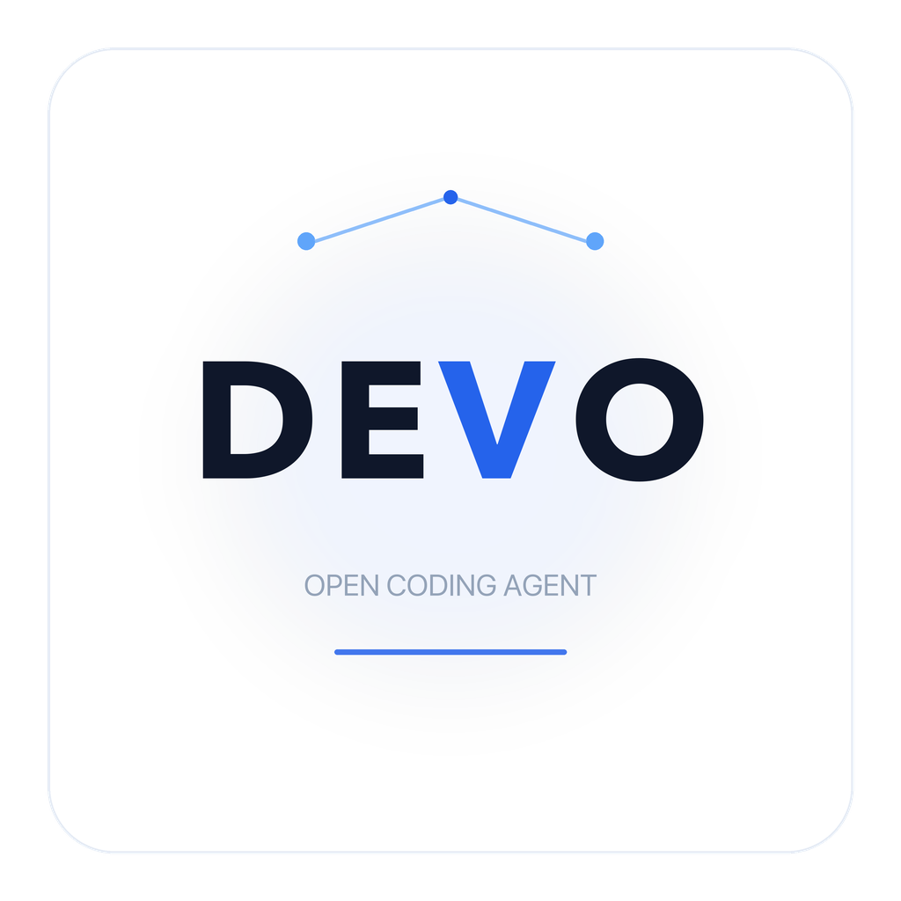
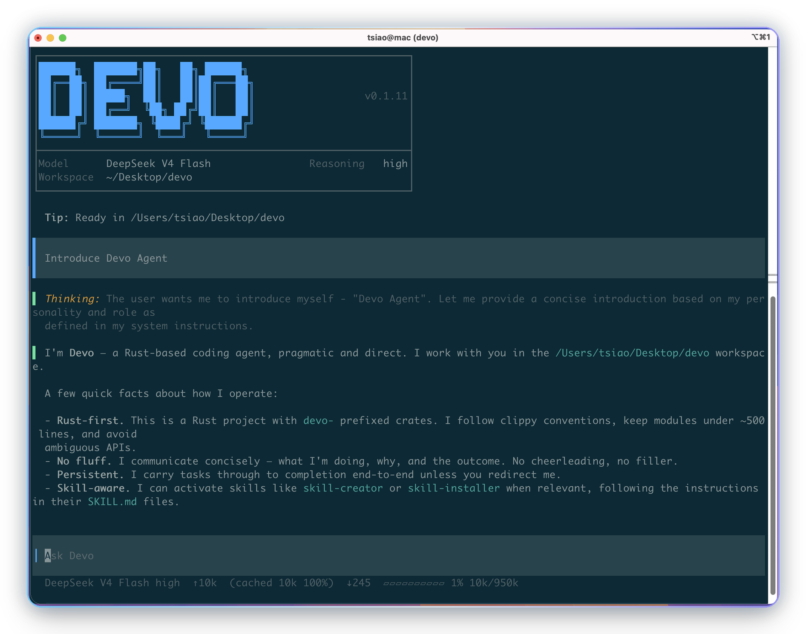

<div align="center">



</div>

<div align="center">

**Легковесный модельно-нейтральный агент для программирования, который работает как единый бинарный файл. Быстрый, token-эффективный и гибко настраиваемый.**

[](https://github.com/7df-lab/devo/stargazers)
[](https://www.rust-lang.org/)
[](./LICENSE)
[](https://github.com/7df-lab/devo/pulls)
[](https://github.com/7df-lab/devo/actions)
[](https://github.com/7df-lab/devo/releases)

[English](./README.md) | [简体中文](./README.zh-Hans.md) | [繁體中文](./README.zh-Hant.md) | [日本語](./README.ja.md) | [Русский](./README.ru.md)

[Возможности](#возможности) · [Проверенные модели](#проверенные-модели) · [Проверенные платформы](#проверенные-платформы) · [Установка](#установка) · [Быстрый старт](#быстрый-старт) · [Документация](#docs)

</div>

---

## Возможности

- **Встроенный семантический поиск по коду** - Запускает локальную CPU-модель
  эмбеддингов кода и сочетает плотный поиск с BM25-поиском по ключевым словам,
  сокращая объем контекста для поиска по коду по сравнению с агентами, которые
  используют только grep/find.
- **Подключайте своего поставщика моделей** - Используйте provider/model bindings
  для OpenAI-совместимых, Anthropic-совместимых, DeepSeek, Qwen, Kimi, GLM,
  MiniMax, Xiaomi MiMo, OpenRouter или локальных endpoint.
- **Поддержка MCP** - Подключайте внешние инструменты и контекст через серверы
  [Model Context Protocol](https://modelcontextprotocol.io/).
- **Поддержка Skill** - Упаковывайте повторяемые workflow, инструкции, скрипты
  и справочные материалы как переиспользуемые
  [Agent Skills](https://agentskills.io/).
- **Поддержка долгих задач** - Позвольте Devo автоматически управлять контекстом
  в многошаговой работе, чтобы не терять ход задачи по мере ее роста.
- **Поддержка нескольких агентов** - Разделяйте работу между специализированными
  агентами, сохраняя координацию видимой в сессии.
- **Plan Mode** - Разбивайте крупные задачи на понятные многошаговые планы до
  начала реализации.
- **Параллельные вызовы инструментов** - Запускайте несколько независимых
  инструментов параллельно, чтобы модели меньше ждали и быстрее продвигались.
- **Выполнение инструментов с разрешениями** - Проверяйте чувствительные вызовы
  инструментов до того, как они затронут рабочую область.
- **Аудируемые сессии** - Храните вывод модели, вызовы инструментов, approvals,
  расход token и историю сессии в виде, пригодном для проверки и возобновления.
- **Видимость стоимости и контекста** - Показывайте input/output token,
  cached token и использование context window там, где провайдеры это раскрывают.
- **Легковесный Rust runtime** - Построен на Rust, с малым расходом памяти и
  компактным локальным runtime.

## Проверенные модели

<p>
  
  
  
  
  
</p>

Встроенный каталог моделей Devo содержит проверенные определения моделей для
Qwen, Kimi, MiniMax, GLM и DeepSeek. Endpoint поставщиков остаются настраиваемыми
через provider/model bindings.

## Проверенные платформы

<p>
  
  
  
</p>

Devo протестирован на macOS, Linux, Windows и Kylin OS.

### Для китайских корпоративных пользователей

<p>
  
  
</p>

Поддержка Kylin OS выделена отдельно, потому что отечественные операционные системы
часто являются реальным требованием при внедрении в китайских корпоративных средах.
Поддержка HarmonyOS находится в roadmap; мы приветствуем вклад участников с
устройствами HarmonyOS, которые смогут собрать, протестировать и опубликовать
релизы для этой платформы.

## Скриншоты

<p align="center">
  
</p>

## Установка

### Linux / macOS

```bash
curl -fsSL https://raw.githubusercontent.com/7df-lab/devo/main/install.sh | sh
```

### Windows

```powershell
irm 'https://raw.githubusercontent.com/7df-lab/devo/main/install.ps1' | iex
```

Онлайн-установщик размещает `devo` в Devo home directory, устанавливает
вспомогательный `rg` sidecar для быстрого поиска по репозиторию и может заранее
установить локальную модель Hugging Face, которую использует `code_search`.

Предварительная установка локальной модели `code_search`:

Linux / macOS:

```bash
curl -fsSL https://raw.githubusercontent.com/7df-lab/devo/main/install.sh | sh -s -- --install-code-search-model
```

Windows:

```powershell
$env:DEVO_INSTALL_CODE_SEARCH_MODEL = "1"; irm 'https://raw.githubusercontent.com/7df-lab/devo/main/install.ps1' | iex
```

Обновление существующей установки до последнего release:

```bash
devo upgrade
```

Команда обновления запускает тот же установщик для текущей платформы, а
установщик выводит переход версии, например `Version: v0.1.12 -> v0.1.15`.

<details>
<summary>Офлайн-установка</summary>

Многие корпоративные и intranet-среды не имеют доступа к интернету. Установщики
Devo поддерживают офлайн-режим: они читают все необходимые assets из того же
каталога, что и скрипт установщика, и не обращаются к сети.

На машине с доступом к интернету:

1. Скачайте скрипт установщика: `install.sh` для Linux/macOS или `install.ps1`
   для Windows.
2. Скачайте последний Devo release asset для целевой CPU и OS, например
   `x86_64` или `aarch64`/`arm64`.
3. Скачайте файлы модели Hugging Face `minishlab/potion-code-16M`, которую
   использует локальный семантический `code_search`: `config.json`,
   `model.safetensors` и `tokenizer.json`.
4. Скачайте соответствующий `ripgrep` release asset для целевой CPU и OS.

Положите эти файлы рядом со скриптом установщика. Файлы модели можно положить
непосредственно рядом со скриптом или в подкаталог
`minishlab--potion-code-16M/`.

Linux / macOS:

```bash
sh ./install.sh --offline
```

Windows:

```powershell
.\install.ps1 -Offline
```

Офлайн-режим устанавливает модель в
`<DEVO_HOME>/local-models/minishlab--potion-code-16M`; это каталог, который
использует runtime code-search provider. Если `DEVO_HOME` не задан, путь будет
`~/.devo/local-models/minishlab--potion-code-16M`.

</details>

## Быстрый старт

Настройте provider, откройте репозиторий и запустите TUI:

```bash
cd /path/to/your/repo
devo onboard
```

Полезные команды:

```bash
devo                         # запустить интерактивный TUI в текущем репозитории
devo resume <session-id>
```

## Конфигурация

`devo onboard` - рекомендуемый путь настройки. Для ручной конфигурации Devo
объединяет настройки в таком порядке:

1. Встроенные значения по умолчанию
2. `DEVO_HOME/config.toml` - пользовательская конфигурация, по умолчанию
   `~/.devo/config.toml` на macOS/Linux и
   `C:\Users\yourname\.devo\config.toml` на Windows
3. `<workspace>/.devo/config.toml` - конфигурация уровня проекта
4. CLI flags

Учетные данные хранятся отдельно в `DEVO_HOME/auth.json`; `config.toml` должен
ссылаться на credential id, а не хранить API key напрямую.

Минимальная структура:

```toml
[defaults]
model_binding = "deepseek-v4-flash-api-deepseek-com"

[providers."api.deepseek.com"]
enabled = true
name = "api.deepseek.com"
base_url = "https://api.deepseek.com"
credential = "api_deepseek_com_api_key"
wire_apis = ["openai_chat_completions"]

[model_bindings.deepseek-v4-flash-api-deepseek-com]
enabled = true
model_slug = "deepseek-v4-flash"
provider = "api.deepseek.com"
model_name = "deepseek-v4-flash"
display_name = "DeepSeek V4 Flash"
invocation_method = "openai_chat_completions"
default_reasoning_effort = "high"
```

Важное разделение:

- `model_slug` выбирает локальные метаданные модели Devo из `models.json`.
- `provider` выбирает настроенную запись подключения.
- `model_name` - строка модели, специфичная для поставщика и отправляемая по wire.
- `invocation_method` выбирает протокол поставщика, например
  [`openai_chat_completions`](https://developers.openai.com/api/reference/chat-completions/overview),
  [`openai_responses`](https://developers.openai.com/api/reference/responses/overview)
  или [`anthropic_messages`](https://platform.claude.com/docs/en/api/messages).

### Пользовательские модели

Если нужной модели нет во встроенном списке, добавьте ее в `models.json`, затем
привяжите через `config.toml`.

Пользовательский каталог моделей:

- macOS/Linux: `~/.devo/models.json`
- Windows: `C:\Users\yourname\.devo\models.json`

Переопределения уровня проекта также можно поместить в
`<workspace>/.devo/models.json`. В `models.json` поле `provider` является
метаданными wire API по умолчанию для модели; фактический endpoint по-прежнему
выбирается полем `provider` в `config.toml`.

Пример записи `models.json`:

```json
[
  {
    "slug": "my-coding-model",
    "display_name": "My Coding Model",
    "channel": "Custom",
    "provider": "openai_chat_completions",
    "description": "Custom OpenAI-compatible coding model.",
    "reasoning_capability": "unsupported",
    "context_window": 200000,
    "effective_context_window_percent": 95,
    "max_tokens": 4096,
    "input_modalities": ["text"],
    "base_instructions": "You are Devo, a coding agent. Help the user edit and understand code."
  }
]
```

Затем сошлитесь на этот `slug` из model binding:

```toml
[model_bindings.my-coding-model-example]
enabled = true
model_slug = "my-coding-model"
provider = "my.provider"
model_name = "provider-specific-model-name"
display_name = "My Coding Model"
invocation_method = "openai_chat_completions"
```

## Часто задаваемые вопросы

### Каков статус проекта?

Devo находится на стадии pre-1.0 и активно развивается. Он готов для локальной
оценки, экспериментов и использования участниками проекта; публичные API и
конфигурация еще могут меняться.

### Какие модели поддерживаются?

Встроенные метаданные моделей сейчас покрывают семейства Qwen, Kimi, MiniMax,
GLM и DeepSeek. Любой endpoint модели, который поддерживает OpenAI-compatible
Chat Completions, OpenAI-compatible Responses или Anthropic Messages API, можно
подключить через provider/model bindings.

## Участие в разработке

Вклад приветствуется, пока проект остается ранним:

- Архитектурная обратная связь по client/server runtime, provider layer, safety
  model и TUI.
- Документация и переводы.
- Покрытие Provider, model и wire API.
- Точечные исправления с командами проверки и регрессионными тестами.

Откройте issue или pull request, чтобы обсудить изменения.

## История звезд

<a href="https://www.star-history.com/?repos=7df-lab%2Fdevo&type=date&legend=top-left">
 <picture>
   <source media="(prefers-color-scheme: dark)" srcset="https://api.star-history.com/chart?repos=7df-lab/devo&type=date&theme=dark&legend=top-left" />
   <source media="(prefers-color-scheme: light)" srcset="https://api.star-history.com/chart?repos=7df-lab/devo&type=date&legend=top-left" />
   
 </picture>
</a>

## Лицензия

Проект распространяется по [MIT License](./LICENSE).

---

**Если Devo оказался полезен, пожалуйста, поставьте ему star.**
