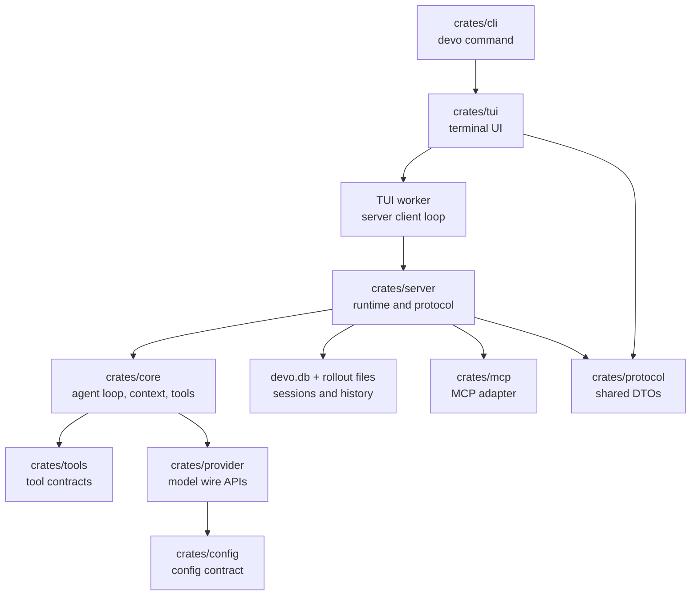

Devo is a Rust workspace built around one interactive path: the `devo` CLI
starts the TUI, the TUI sends user actions to a background worker, the worker
talks to the server protocol, and the server runtime drives sessions, tools,
persistence, goals, subagents, and model providers.

Use this page as the first map before reading feature-specific code.

## Runtime Shape

The important boundary is between `crates/tui` and `crates/server`. The TUI owns
terminal state and user interaction. The server owns long-running runtime state
and the agent execution model.

## Main Crates

| Crate | Responsibility |
| --- | --- |
| `devo-cli` | Parses `devo`, `devo onboard`, `devo resume`, `devo prompt`, `devo doctor`, `devo upgrade`, and `devo server`. |
| `devo-arg0` | Lets one binary dispatch by executable name, so `devo` and server-style entrypoints can share one executable. |
| `devo-tui` | Interactive terminal UI, composer, onboarding, model picker, slash commands, transcript rendering, and worker event handling. |
| `devo-server` | Transport-neutral runtime, session lifecycle, event protocol, persistence, compaction, goals, subagents, reference search, shell execution, and provider/vendor APIs. |
| `devo-core` | Agent loop, message/session model, context pipeline, instruction discovery, permissions, hooks, tool registry, query execution, and compaction helpers. |
| `devo-provider` | Provider router and OpenAI/Anthropic-compatible streaming adapters. |
| `devo-protocol` | Shared request, response, event, provider, permission, reference-search, command-exec, goal, and session types. |
| `devo-config` | Serializable config contract for app, provider, server, tool, hook, MCP, skill, and logging settings. |
| `devo-tools` | Tool contracts shared by core, server, and clients. |
| `devo-mcp` | RMCP-backed MCP runtime adapter. |
| `devo-code-search` | Local semantic code retrieval implementation. |
| `devo-file-search` | Fuzzy file search used by composer reference search. |
| `devo-safety` | Approval and sandbox policy contracts. |

## Startup Flow

When a user runs `devo`:

1. `crates/cli/src/main.rs` parses the command.
2. The default command calls `run_agent` in `crates/cli/src/agent_command.rs`.
3. `run_agent` resolves the current working directory, `DEVO_HOME`, effective
   config, model catalog, permission preset, provider settings, and saved model
   entries.
4. `run_agent` calls `devo_tui::run_interactive_tui`.
5. The TUI starts with an `InitialTuiSession` containing the current session id,
   model, model binding id, provider wire API, reasoning effort selection, permission
   preset, and working directory.

`devo onboard` follows the same path, but forces the TUI into provider
onboarding mode.

`devo resume <session_id>` follows the same path with an initial session id.

## Interactive Turn Flow

A normal user turn crosses these layers:

1. The composer in `crates/tui/src/bottom_pane` turns key input into an
   `InputResult`.
2. `ChatWidget` maps that input into an `AppCommand`.
3. `crates/tui/src/worker.rs` receives the command through its internal
   `OperationCommand` channel.
4. The worker ensures a server session exists, then calls `turn_start` with
   `TurnStartParams`.
5. `crates/server/src/runtime.rs` owns the session, creates the turn, runs the
   core query path, emits server events, persists records, and updates runtime
   state.
6. The worker maps server events into `WorkerEvent` values.
7. `ChatWidget` renders those events into transcript cells, status lines,
   approval overlays, tool cells, plan cells, and final turn state.

The TUI does not call model providers directly. Provider calls happen behind the
server/core/provider boundary.

## Server Runtime

`ServerRuntime` is the stateful runtime. It owns:

- Active sessions.
- Active turn tasks and cancellation tokens.
- Client connections and subscriptions.
- Per-session goals.
- Subagent registries, mailboxes, and output buffers.
- Live reference search sessions.
- Live shell/process sessions.
- Persistence through the database and rollout store.

The bootstrap path in `crates/server/src/bootstrap.rs` builds the runtime from
effective config. It creates the MCP manager, tool registry, model catalog,
provider router, skill catalog, SQLite database, and runtime dependencies, then
restores persisted sessions before starting listeners.

## Tools And Permissions

Tools are registered from config in the server bootstrap path and executed from
the core query runtime. The shared tool contract lives in `devo-tools`; concrete
runtime behavior lives under `devo-core/src/tools`.

Permission decisions are part of the server/core runtime, not just the TUI. The
TUI displays approval requests and sends decisions back to the server. The
server applies those decisions to the active turn.

## Provider Flow

Provider configuration starts as user config, then resolves into a provider and
model binding:

1. `devo-config` defines the serialized provider and model binding fields.
2. `devo-core` resolves effective provider settings for the current workspace.
3. `devo-server` builds the provider router during bootstrap.
4. `devo-provider` sends requests through the selected wire API.

Current wire API names are defined in protocol/model code:

| Wire API | Use for |
| --- | --- |
| `openai_chat_completions` | OpenAI-compatible Chat Completions providers. |
| `openai_responses` | OpenAI Responses-compatible providers. |
| `anthropic_messages` | Anthropic Messages-compatible providers. |

## Reference Search Flow

Composer `@` search is client-owned but server-backed:

1. The composer detects an `@token`.
2. The TUI sends `ReferenceSearchRequested` to the worker.
3. The worker calls the server reference-search API.
4. The server uses live reference search state and file search.
5. Results flow back as `ReferenceSearchUpdated`.
6. The composer popup renders file, skill, and MCP results.

This keeps fuzzy search responsive without putting file indexing state directly
inside the visible TUI widgets.

## Shell Command Flow

User shell commands from `!` mode are not normal chat turns:

1. The composer returns `ShellCommand` or `ShellInput`.
2. `ChatWidget` sends `execute_shell_command` or `submit_shell_input`.
3. The worker rejects the command if a turn is already active.
4. The worker starts a command execution session through the server.
5. Server command-exec output events are mapped back into TUI tool-output cells.

This is separate from model-requested shell tools, even though both eventually
render command output in the transcript.

## Where To Start

| Change | Start here |
| --- | --- |
| CLI command or flags | `crates/cli/src/main.rs` |
| Interactive startup config | `crates/cli/src/agent_command.rs` |
| Composer key behavior | `crates/tui/src/bottom_pane/chat_composer.rs` |
| Mode switching and shell trigger | `crates/tui/src/bottom_pane/mod.rs` |
| Transcript rendering | `crates/tui/src/chatwidget` and `crates/tui/src/history_cell.rs` |
| Worker/server event mapping | `crates/tui/src/worker.rs` |
| Session lifecycle | `crates/server/src/runtime.rs` |
| Server startup | `crates/server/src/bootstrap.rs` |
| Provider config and validation | `crates/server/src/provider_config.rs` |
| Provider wire behavior | `crates/provider/src/openai` and `crates/provider/src/anthropic` |
| Tool registration and execution | `crates/core/src/tools` |
| Config schema | `crates/config/src` |
| Shared protocol DTOs | `crates/protocol/src` |

## Contributor Rule Of Thumb

Keep UI state in `devo-tui`, runtime/session state in `devo-server`, agent and
tool semantics in `devo-core`, provider-specific request/stream handling in
`devo-provider`, and serialized config shapes in `devo-config`.

When a feature crosses layers, change the shared DTO in `devo-protocol` first,
then update server handling, worker mapping, and TUI rendering in that order.
