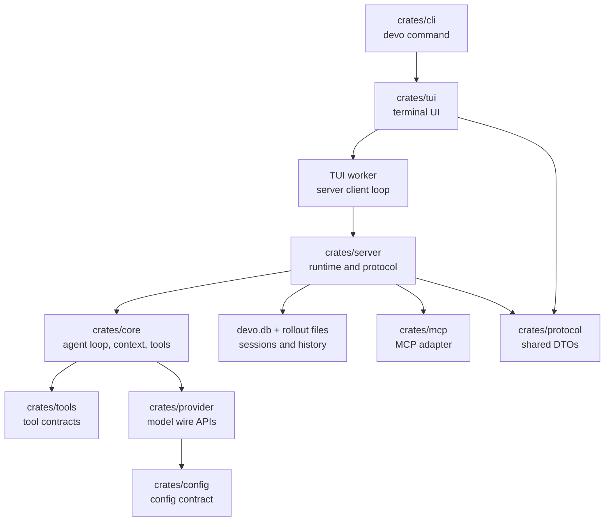

Devo 是一个 Rust workspace，围绕一条交互路径构建：`devo` CLI 启动 TUI，TUI 将用户动作发送给后台 worker，worker 与 server protocol 通信，server runtime 驱动 sessions、tools、persistence、goals、subagents 和 model providers。

先用这页定位边界，再读具体功能代码。

## Runtime 形态

最重要的边界在 `crates/tui` 和 `crates/server` 之间。TUI 拥有终端状态和用户交互。Server 拥有长生命周期 runtime state 和 agent execution model。

## 主要 Crates

| Crate | Responsibility |
| --- | --- |
| `devo-cli` | 解析 `devo`、`devo onboard`、`devo resume`、`devo prompt`、`devo doctor`、`devo upgrade` 和 `devo server`。 |
| `devo-arg0` | 允许一个 binary 按可执行文件名分发，因此 `devo` 和 server-style entrypoint 可以共享同一个 executable。 |
| `devo-tui` | 交互式终端 UI、composer、onboarding、model picker、slash commands、transcript rendering 和 worker event handling。 |
| `devo-server` | Transport-neutral runtime、session lifecycle、event protocol、persistence、compaction、goals、subagents、reference search、shell execution 和 provider/vendor APIs。 |
| `devo-core` | Agent loop、message/session model、context pipeline、instruction discovery、permissions、hooks、tool registry、query execution 和 compaction helpers。 |
| `devo-provider` | Provider router，以及 OpenAI/Anthropic-compatible streaming adapters。 |
| `devo-protocol` | 共享的 request、response、event、provider、permission、reference-search、command-exec、goal 和 session types。 |
| `devo-config` | App、provider、server、tool、hook、MCP、skill 和 logging 设置的可序列化配置 contract。 |
| `devo-tools` | Core、server 和 clients 共享的 tool contracts。 |
| `devo-mcp` | 基于 RMCP 的 MCP runtime adapter。 |
| `devo-code-search` | 本地语义代码检索实现。 |
| `devo-file-search` | Composer reference search 使用的 fuzzy file search。 |
| `devo-safety` | Approval 和 sandbox policy contracts。 |

## 启动流程

用户运行 `devo` 时：

1. `crates/cli/src/main.rs` 解析命令。
2. 默认命令调用 `crates/cli/src/agent_command.rs` 中的 `run_agent`。
3. `run_agent` 解析当前工作目录、`DEVO_HOME`、effective config、model catalog、permission preset、provider settings 和 saved model entries。
4. `run_agent` 调用 `devo_tui::run_interactive_tui`。
5. TUI 以 `InitialTuiSession` 启动，其中包含当前 session id、model、model binding id、provider wire API、reasoning effort selection、permission preset 和 working directory。

`devo onboard` 使用同一路径，但强制 TUI 进入 provider onboarding mode。

`devo resume <session_id>` 使用同一路径，并传入 initial session id。

## 交互 Turn 流程

一次普通用户 turn 会跨过这些层：

1. `crates/tui/src/bottom_pane` 中的 composer 将 key input 转成 `InputResult`。
2. `ChatWidget` 将该输入映射为 `AppCommand`。
3. `crates/tui/src/worker.rs` 通过内部 `OperationCommand` channel 接收命令。
4. Worker 确认或创建 server session，然后用 `TurnStartParams` 调用 `turn_start`。
5. `crates/server/src/runtime.rs` 拥有 session，创建 turn，运行 core query path，发送 server events，持久化 records，并更新 runtime state。
6. Worker 将 server events 映射为 `WorkerEvent`。
7. `ChatWidget` 将事件渲染为 transcript cells、status lines、approval overlays、tool cells、plan cells 和最终 turn state。

TUI 不直接调用 model providers。Provider calls 位于 server/core/provider 边界之后。

## Server Runtime

`ServerRuntime` 是有状态 runtime。它拥有：

- Active sessions。
- Active turn tasks 和 cancellation tokens。
- Client connections 和 subscriptions。
- Per-session goals。
- Subagent registries、mailboxes 和 output buffers。
- Live reference search sessions。
- Live shell/process sessions。
- 通过 database 和 rollout store 实现的持久化。

`crates/server/src/bootstrap.rs` 中的 bootstrap path 从 effective config 构建 runtime。它会创建 MCP manager、tool registry、model catalog、provider router、skill catalog、SQLite database 和 runtime dependencies，然后在启动 listeners 前恢复已持久化的 sessions。

## Tools 和 Permissions

Tools 在 server bootstrap path 中从配置注册，并由 core query runtime 执行。共享 tool contract 位于 `devo-tools`；具体 runtime 行为位于 `devo-core/src/tools` 下。

Permission decisions 是 server/core runtime 的一部分，不是单纯的 TUI 行为。TUI 显示 approval request，并将 decision 发回 server。Server 将这些 decision 应用到当前 turn。

## Provider 流程

Provider 配置从用户配置开始，再解析为 provider 和 model binding：

1. `devo-config` 定义序列化的 provider 和 model binding 字段。
2. `devo-core` 为当前工作区解析 effective provider settings。
3. `devo-server` 在 bootstrap 时构建 provider router。
4. `devo-provider` 通过选中的 wire API 发送请求。

当前 wire API 名称在 protocol/model code 中定义：

| Wire API | Use for |
| --- | --- |
| `openai_chat_completions` | OpenAI-compatible Chat Completions providers。 |
| `openai_responses` | OpenAI Responses-compatible providers。 |
| `anthropic_messages` | Anthropic Messages-compatible providers。 |

## Reference Search 流程

Composer `@` search 是 client-owned 但 server-backed：

1. Composer 检测到 `@token`。
2. TUI 向 worker 发送 `ReferenceSearchRequested`。
3. Worker 调用 server reference-search API。
4. Server 使用 live reference search state 和 file search。
5. 结果作为 `ReferenceSearchUpdated` 返回。
6. Composer popup 渲染 file、skill 和 MCP results。

这让 fuzzy search 保持响应，同时避免把 file indexing state 直接放进可见 TUI widgets。

## Shell Command 流程

用户从 `!` mode 发出的 shell command 不是普通 chat turn：

1. Composer 返回 `ShellCommand` 或 `ShellInput`。
2. `ChatWidget` 发送 `execute_shell_command` 或 `submit_shell_input`。
3. 如果已有 turn 正在运行，worker 会拒绝该命令。
4. Worker 通过 server 启动 command execution session。
5. Server command-exec output events 被映射回 TUI tool-output cells。

这与模型请求的 shell tools 分开，即使两者最终都在 transcript 中渲染 command output。

## 从哪里开始

| Change | Start here |
| --- | --- |
| CLI command 或 flags | `crates/cli/src/main.rs` |
| Interactive startup config | `crates/cli/src/agent_command.rs` |
| Composer key behavior | `crates/tui/src/bottom_pane/chat_composer.rs` |
| Mode switching 和 shell trigger | `crates/tui/src/bottom_pane/mod.rs` |
| Transcript rendering | `crates/tui/src/chatwidget` 和 `crates/tui/src/history_cell.rs` |
| Worker/server event mapping | `crates/tui/src/worker.rs` |
| Session lifecycle | `crates/server/src/runtime.rs` |
| Server startup | `crates/server/src/bootstrap.rs` |
| Provider config and validation | `crates/server/src/provider_config.rs` |
| Provider wire behavior | `crates/provider/src/openai` 和 `crates/provider/src/anthropic` |
| Tool registration and execution | `crates/core/src/tools` |
| Config schema | `crates/config/src` |
| Shared protocol DTOs | `crates/protocol/src` |

## 贡献者经验法则

UI state 放在 `devo-tui`，runtime/session state 放在 `devo-server`，agent 和 tool semantics 放在 `devo-core`，provider-specific request/stream handling 放在 `devo-provider`，serialized config shapes 放在 `devo-config`。

当功能跨层时，先修改 `devo-protocol` 中的共享 DTO，再按顺序更新 server handling、worker mapping 和 TUI rendering。
