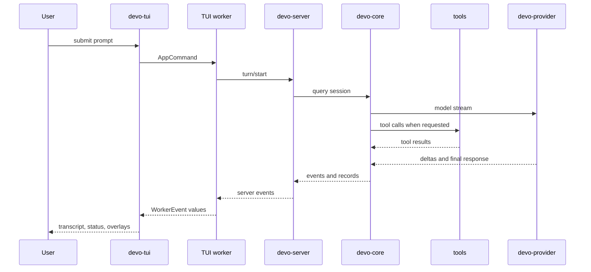

This page follows one normal user prompt through Devo.

## Turn Path

## 1. Composer Input

The bottom pane turns keyboard input into an input result. A normal prompt is
converted into a chat-widget command path; shell mode and reference search use
separate paths.

The chat widget attaches current UI state such as collaboration mode and
approval policy, then sends an `AppCommand` to the host loop.

## 2. Worker Command

`crates/tui/src/worker.rs` receives the command as an `OperationCommand`.

For a normal prompt, the worker:

1. ensures a server session exists;
2. applies current model, binding id, permission preset, and reasoning effort selection;
3. sends `TurnStartParams` to the server;
4. subscribes to turn events;
5. maps server events into TUI-facing `WorkerEvent` values.

The worker also rejects some actions while a turn is active. For example, direct
shell command execution is refused when a model turn is already running.

## 3. Server Runtime

`crates/server/src/runtime.rs` owns session lifecycle. A turn creates or updates
server-side session state, persists durable records, and connects the turn to
runtime dependencies such as:

- provider router;
- model catalog;
- MCP manager;
- skill catalog;
- tool registry;
- goal state;
- subagent coordinator;
- command execution state;
- persistence stores.

Server handlers live under `crates/server/src/runtime/handlers`.

## 4. Core Query

The server delegates agent execution to `devo-core`.

Core owns:

- session message state;
- instruction discovery;
- context construction;
- compaction;
- tool registry execution;
- permission checks;
- hook execution;
- model request assembly;
- event callbacks back to the server.

Provider calls are not made from the TUI. They happen from the core execution
path through the provider router supplied by the server.

## 5. Tools And Approvals

When the model requests a tool, core checks the active permission policy. If a
decision is needed, the server emits an approval request and pauses the tool
until the TUI responds.

The TUI renders the approval overlay. The user's decision is sent back through
the worker as an approval response. Server/core then either run or reject the
tool call.

## 6. Streaming Back

The provider stream produces assistant text, reasoning events, tool-call
events, and final completion state. Core emits structured events to the server.

The server persists durable records and forwards events to subscribed clients.
The worker maps those server events into transcript items, plan steps, tool
cells, status updates, and final turn state.

## 7. Persistence And Resume

Interactive sessions persist enough metadata and records for `devo resume` and
`/resume` to reconstruct history. Resume starts through the same interactive
startup path, but passes an initial session id into the TUI and worker.

When changing persistence or event shapes, check both new-session and resumed
session behavior.

## 8. Special Paths

Not every user action is a normal turn:

| Surface | Path |
| --- | --- |
| `@` fuzzy search | TUI reference-search request to server, then picker results back to composer. |
| `!` shell mode | Command-exec runtime path, separate from model-requested shell tools. |
| `/btw` | Worker asks server to run a side question through child-agent runtime. |
| `/compact` | Worker calls session compaction without creating a normal user turn. |
| `/goal` | Worker calls goal APIs for show, edit, set, pause, resume, or clear. |

Keep these paths separate unless the runtime behavior truly belongs in a normal
model turn.
