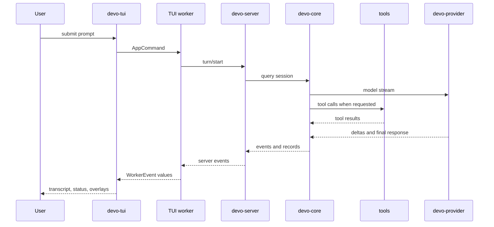

这页跟踪一个普通用户 prompt 如何经过 Devo。

## Turn Path

## 1. Composer Input

Bottom pane 将键盘输入转成 input result。普通 prompt 会转换到 chat-widget command path；shell mode 和 reference search 使用不同路径。

Chat widget 附加当前 UI state，例如 collaboration mode 和 approval policy，然后将 `AppCommand` 发送到 host loop。

## 2. Worker Command

`crates/tui/src/worker.rs` 以 `OperationCommand` 接收命令。

对普通 prompt，worker 会：

1. 确认或创建 server session；
2. 应用当前 model、binding id、permission preset 和 reasoning effort selection；
3. 将 `TurnStartParams` 发送给 server；
4. 订阅 turn events；
5. 将 server events 映射为面向 TUI 的 `WorkerEvent`。

Worker 也会在 turn 活跃时拒绝某些动作。例如，当 model turn 正在运行时，会拒绝直接 shell command execution。

## 3. Server Runtime

`crates/server/src/runtime.rs` 拥有 session lifecycle。一次 turn 会创建或更新 server-side session state，持久化 durable records，并将 turn 连接到 runtime dependencies，例如：

- provider router；
- model catalog；
- MCP manager；
- skill catalog；
- tool registry；
- goal state；
- subagent coordinator；
- command execution state；
- persistence stores。

Server handlers 位于 `crates/server/src/runtime/handlers` 下。

## 4. Core Query

Server 将 agent execution 委托给 `devo-core`。

Core 拥有：

- session message state；
- instruction discovery；
- context construction；
- compaction；
- tool registry execution；
- permission checks；
- hook execution；
- model request assembly；
- 回调给 server 的 event callbacks。

Provider calls 不从 TUI 发出。它们从 core execution path 通过 server 提供的 provider router 发出。

## 5. Tools 和 Approvals

当模型请求 tool 时，core 检查当前 permission policy。如果需要 decision，server 会发送 approval request，并暂停该 tool，直到 TUI 响应。

TUI 渲染 approval overlay。用户 decision 会作为 approval response 经 worker 发回。Server/core 随后运行或拒绝该 tool call。

## 6. Streaming Back

Provider stream 产生 assistant text、reasoning events、tool-call events 和最终 completion state。Core 将结构化 events 发送给 server。

Server 持久化 durable records，并转发 events 给已订阅的 clients。Worker 将这些 server events 映射为 transcript items、plan steps、tool cells、status updates 和 final turn state。

## 7. Persistence 和 Resume

Interactive sessions 会持久化足够的 metadata 和 records，使 `devo resume` 和 `/resume` 能重建历史。Resume 使用同一条 interactive startup path，但会把 initial session id 传入 TUI 和 worker。

修改 persistence 或 event shape 时，同时检查 new-session 和 resumed-session 行为。

## 8. 特殊路径

不是每个用户动作都是普通 turn：

| Surface | Path |
| --- | --- |
| `@` fuzzy search | TUI reference-search request 到 server，然后 picker results 返回 composer。 |
| `!` shell mode | Command-exec runtime path，与模型请求的 shell tools 分开。 |
| `/btw` | Worker 请求 server 通过 child-agent runtime 运行 side question。 |
| `/compact` | Worker 调用 session compaction，不创建普通 user turn。 |
| `/goal` | Worker 调用 goal APIs，用于 show、edit、set、pause、resume 或 clear。 |

除非 runtime 行为确实属于普通 model turn，否则保持这些路径分离。
